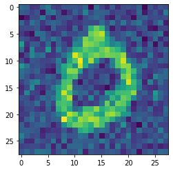

# Noise Remove from MNIST image

## Auto encoder is used to remove the noise from a image of 0-9 digit written on it.

<br/>

> ### Requirements:
> - Tensorflow
> - Pandas
> - Numpy
> - matplotlib

<br/>

## Brief: 
The program is using Auto Encoder technique.

> ## Model Encoder: "sequential"
> ---
> | Layer (type)         | Output Shape     | Param # |
> | -------------------- | ---------------- | ------- |
> | flatten (Flatten)    | (None, 784)      | 0       |
> | dense (Dense)        | (None, 400)      | 314000  |
> | dense (Dense)        | (None, 200)      | 80200   |
> | dense (Dense)        | (None, 100)      | 20100   |
> | dense (Dense)        | (None, 50)       | 5050    |
> | dense (Dense)        | (None, 25)       | 1275    |

<br/>

> ## Model Decoder: "sequential"
> ---
> | Layer (type)         | Output Shape     | Param # |
> | -------------------- | ---------------- | ------- |
> | dense (Dense)        | (None, 50)       | 1300    |
> | dense (Dense)        | (None, 100)      | 5100    |
> | dense (Dense)        | (None, 200)      | 20200   |
> | dense (Dense)        | (None, 400)      | 80400   |
> | dense (Dense)        | (None, 784)      | 314384  |> | dreshape (Reshape)   | (None, 28, 28)   | 0       |


<br/>

> ## Model AutoEncoder: "sequential"
> ---
> | Layer (type)         | Output Shape     | Param # |
> | -------------------- | ---------------- | ------- |
> |sequential (Sequential)| (None, 25)      | 420625  |
> |sequential (Sequential)| (None, 28, 28)  | 421384  |


<br/>

## Example:

```python
denoised = noise_remover(ten_noisy_images)
print("noisy image")
plt.imshow(ten_noisy_images[n])
plt.show()
print("denoised image")
plt.imshow(denoised[n])
```
> ## Input:


> ## Output: 


